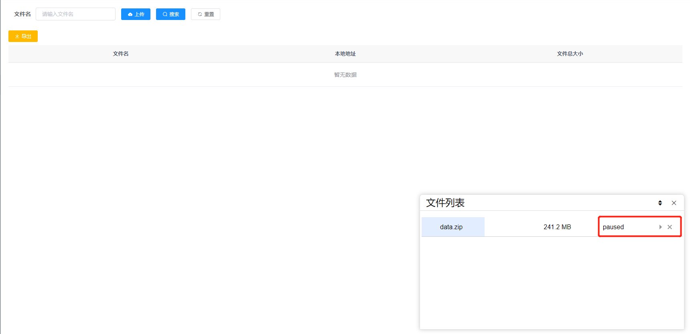

# file-uploader

#### 介绍
以vue-uploader及若依框架为基础搭建的文件上传系统，前端为vue2.6.1，后端为SpringBoot2.1.1。

1. 支持多文件上传
2. 大文件上传，可暂停文件上传
3. 支持快传，有上传队列管理，支持分块上传
4. 支持进度、预估剩余时间、重试、重传等
5. 且支持了在系统宕机后尽可能的保证文件上传进度能继续
6. 有完整的登录、用户管理、权限管理机制

#### 软件架构
前端使用vue2开发，文件上传部分参考[vue-uploader](https://github.com/simple-uploader/vue-uploader)。
后端使用[若依框架前后端分离版本](https://gitee.com/y_project/RuoYi-Vue)，删减了多余功能，只保留了基础功能，可以在此基础上扩展。
数据库为MySQL5.7。

#### 安装教程

1.  后端安装：
    下载源码后，通过maven进行项目构建及包下载，找到sql文件夹中的file_upload_db.sql文件，在MySQL数据库中创建file_upload_db数据库，然后导入file_upload_db.sql文件完成数据库创建。
    安装redis，启动redis。
    配置好后台的数据库连接等，启动CsixFrameWorkApplication.java。
2.  前端安装：下载完成代码后，执行
```
npm install
```
然后运行
```
npm run dev
```

启动成功后，访问http://localhost:80 
即可访问，默认账号是admin，密码是admin123

#### 使用说明

1.  上传功能，可以多选文件

2.  上传后，可在右下角文件列表出看到该文件，先进行MD5计算，然后开始上传，此时可暂停，可删除

3.  文件列表仅供浏览
